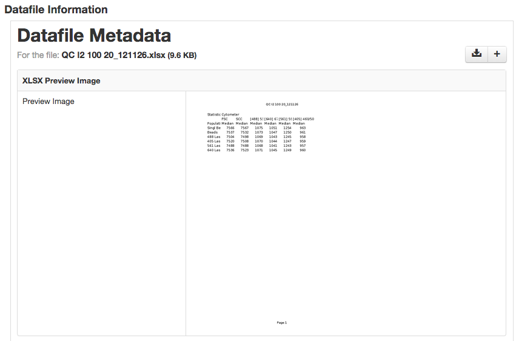

XLSX Preview Image MyTardis Filter
==================================

Filter for generating image thumbnails for MyTardis using Gnumeric's ssconvert tool.



## Requirements
 - ssconvert (http://manpages.ubuntu.com/manpages/trusty/man1/ssconvert.1.html)
 - [MyTardis 3.6](https://github.com/mytardis/mytardis/branches/3.6)

## Installation

 - Install Gnumeric (including ssconvert), using ```sudo apt-get install gnumeric``
 - Install ImageMagick, using ```sudo apt-get install imagemagick```

Git clone this repository into `/path/to/mytardis/tardis/tardis_portal/filters`:
    
    git clone git@github.com:wettenhj/xlsx-mytardis-filter.git xlsx

Add the following to your MyTardis settings file eg. `/path/to/mytardis/tardis/settings.py`

```
MIDDLEWARE_CLASSES = MIDDLEWARE_CLASSES + ('tardis.tardis_portal.filters.FilterInitMiddleware',)

FILTER_MIDDLEWARE = (("tardis.tardis_portal.filters", "FilterInitMiddleware"),)
```

The above enables the filter middleware for all actions.

Then add the definition for this filter.

```
POST_SAVE_FILTERS = [
   ("tardis.tardis_portal.filters.xlsx.xlsx.make_filter",
   ["XLSX", "http://tardis.edu.au/schemas/xlsx/1",
    "/usr/bin/ssconvert"])
   ]
```
`cd /path/to/mytardis` and load the parameter schema into the MyTardis database:

```
python mytardis.py loaddata tardis/tardis_portal/filters/xlsx/xlsx.json
```

Restart MyTardis.
